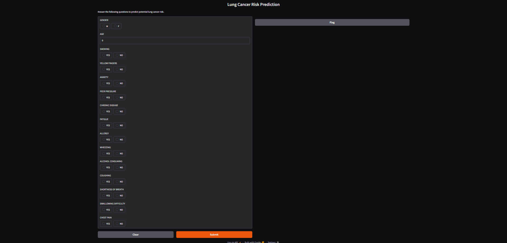

## 🖥️ Web Interface

*#Interactive interface for lung cancer risk prediction*

# 🫁 Lung Cancer Risk Prediction System

A machine learning–powered web application designed to **predict lung cancer risk** based on patient lifestyle habits, symptoms, and health conditions.
This project demonstrates a **complete real-world data science workflow**, from model training to interactive deployment.

## 📌 Overview

Lung cancer is one of the most life-threatening diseases globally, and early risk identification plays a crucial role in improving survival rates.
This project applies machine learning techniques to analyze patient data and predict potential lung cancer presence using a robust ensemble model.

The final solution is deployed as an **interactive web application**, allowing users to input health details and instantly receive a prediction.

## 🎯 Objectives

* Build an accurate lung cancer prediction model
* Apply real-world data preprocessing and feature engineering
* Evaluate model performance using standard ML metrics
* Deploy the trained model using an interactive UI
* Create a portfolio-ready, end-to-end ML project

## 🧠 Machine Learning Approach

* Supervised classification problem
* Ensemble learning using a Random Forest model
* Categorical feature encoding
* Train–test data splitting for unbiased evaluation
* Model persistence for real-time inference

## 📊 Model Evaluation

The model is evaluated using industry-standard metrics to ensure reliability and performance:

* Accuracy Score
* Confusion Matrix
* Precision, Recall, and F1-Score
* Feature Importance Analysis

These evaluations help understand both **model correctness** and **decision behavior**.

## 🔍 Feature Importance

One of the strengths of this project is interpretability.
The model identifies which health and lifestyle factors contribute most to lung cancer risk, supporting explainable and transparent predictions.

## 🖥️ Interactive Web Application

The project includes a user-friendly web interface where:

* Users select health and lifestyle attributes
* Inputs are processed in real time
* The system predicts lung cancer risk instantly

This bridges the gap between **machine learning models** and **real-world usability**.

## 🚀 Real-World Relevance

This project reflects how machine learning can be applied in healthcare domains such as:

* Early disease risk assessment
* Clinical decision support systems
* Preventive healthcare analytics
* Health-focused AI applications

## 🧪 Skills Demonstrated

* Data preprocessing and feature handling
* Supervised machine learning
* Model evaluation and interpretation
* Deployment-ready ML solutions
* Building ML-driven user interfaces

## ⚠️ Disclaimer

This application is intended **strictly for educational and research purposes**.
It should **not** be used as a substitute for professional medical advice or diagnosis.

## 👤 Author

**Sadanand Bhandari**
Artificial Intelligence, Data Science & Machine Learning Practitioner

## ⭐ Support

If you find this project useful:

* ⭐ Star the repository
* 🍴 Fork and experiment
* 🧠 Learn and improve upon it

* Convert it into a **research-style README**
* Create a **professional project description for LinkedIn or portfolio**
